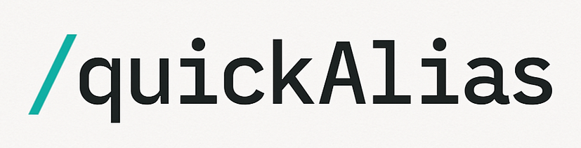

# QuickAlias



A browser extension that allows you to create custom text shortcuts (aliases) preceded by '/' to quickly insert predefined texts.

## Features

- Create custom commands starting with '/'
- Insert predefined texts with a single Tab press
- Support for multiple languages (English and Brazilian Portuguese)
- Dark/Light theme support
- Works in any text input, textarea or contenteditable element (Doesn't work on WhatsApp Web)
- Easy management of commands through a popup interface
- Secure storage of commands in browser local storage

## Installation

Currently available for Firefox. To install:

1. Download the latest release from [Releases](https://github.com/yourusername/QuickAlias/releases)
2. Open Firefox and go to `about:debugging`
3. Click "This Firefox" in the left sidebar
4. Click "Load Temporary Add-on"
5. Select the downloaded `.zip` file

## Usage

1. Click the extension icon in the toolbar
2. Add new commands:
   - Type a command starting with '/' (e.g., "/hello")
   - Enter the text you want to insert
   - Click Save
3. In any text input:
   - Type your command (e.g., "/hello")
   - Press Tab to insert the predefined text
   - Use Escape to dismiss suggestions

## Development

### Prerequisites

- Firefox Browser
- Basic knowledge of JavaScript, HTML, and CSS
- Text editor (VS Code recommended)

### Project Structure

```
QuickAlias/
├── manifest.json       # Extension configuration
├── popup.html         # Popup interface
├── popup.js          # Popup functionality
├── content.js        # Content script for text replacement
├── translations.js   # Language translations
├── style.css        # Popup styles
├── suggestion-box.css # Suggestion box styles
└── icons/           # Extension icons
```

### Building

1. Clone the repository:

```bash
git clone https://github.com/henrikkudesu/quickAlias
cd quickAlias
```

2. Load the extension in Firefox:

- Open `about:debugging`
- Click "This Firefox"
- Click "Load Temporary Add-on"
- Select `manifest.json` from your project folder

### Development Guidelines

1. **Code Style**

   - Use consistent indentation (2 spaces)
   - Follow JavaScript best practices
   - Add comments for complex logic
   - Use meaningful variable and function names

2. **Testing**

   - Test in different contexts (inputs, textareas, contenteditable)
   - Verify dark/light theme transitions
   - Check language switching
   - Ensure proper cleanup of event listeners

3. **Security**
   - Use `browser.storage.local` for data storage
   - Sanitize user inputs
   - Follow Mozilla's security guidelines

## Browser Compatibility

Currently supports:

- Firefox 109.0 or later

Future support planned for:

- Chrome
- Edge
- Safari

## Continuous Development

### Planned Features

- [ ] Import/Export commands
- [ ] Command categories
- [ ] Command search
- [ ] Keyboard shortcuts
- [ ] Cloud sync
- [ ] More language support

### Contributing

1. Fork the repository
2. Create a feature branch
3. Commit your changes
4. Push to the branch
5. Open a Pull Request

## Authors

- Leonardo Nascimento
